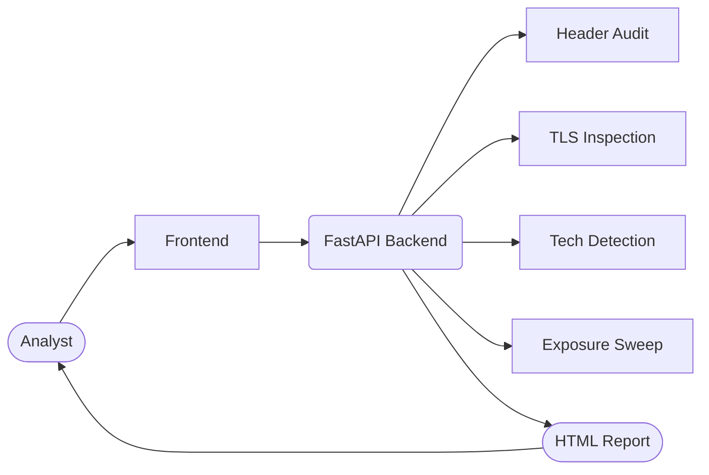

# VulnVision — Passive Reconnaissance & Exposure Radar 🚀

[](https://sr-857.github.io/vulnvision)
[](https://vulnvision.onrender.com/docs)
[](./LICENSE)

VulnVision is a production-grade passive reconnaissance platform built for hackathon judging panels and real-world teams alike. Launch the dashboard, target any public domain, and receive an end-to-end intelligence package—technology fingerprinting, security-header grading, TLS analytics, exposure sweeps, and a branded HTML report—without sending intrusive traffic.

> **Ethical use only.** VulnVision performs non-intrusive, read-only checks. Obtain permission before scanning a target.

---

## 📚 Table of Contents

1. [Platform Highlights](#-platform-highlights)
2. [Live Experience](#-live-experience)
3. [Architecture Overview](#-architecture-overview)
4. [Quick Start (Local)](#-quick-start-local)
5. [Production Deployment](#-production-deployment)
6. [Feature Deep Dive](#-feature-deep-dive)
7. [API Reference](#-api-reference-ui-contract)
8. [Quality & CI](#-quality--ci)
9. [Contributing & Hackathon Checklist](#-contributing--hackathon-checklist)
10. [License](#-license)

---

## ✨ Platform Highlights

- **Live dashboard** served via GitHub Pages — zero setup for judges
- **FastAPI backend** on Render — shared API powering the scan and report endpoints
- **Technology detection engine** combining DOM signatures, response headers, and favicon hashing
- **Exposure sweeps** across 30+ high-signal paths (git leaks, config dumps, admin panels, monitoring consoles)
- **TLS intelligence** with expiry warnings, SAN display, and risk snapshots
- **Rate limiting + caching** to keep the API responsive during demos
- **HTML report** that mirrors the dashboard layout for handover

## 🌐 Live Experience

- **Primary Landing Site:** [my-site-ddg6q6cw-subhajitroy857.wix-vibe.com](https://my-site-ddg6q6cw-subhajitroy857.wix-vibe.com/) — full marketing narrative and judge-facing entry point.
- **Product Dashboard:** [sr-857.github.io/vulnvision](https://sr-857.github.io/vulnvision/) — interactive scan console with live API wiring.
- **API Gateway:** [vulnvision.onrender.com](https://vulnvision.onrender.com/) — FastAPI service exposing `/scan` and `/report`, protected by caching and rate limiting.
- **Sample Report:** [docs/examples/demo_report.html](docs/examples/demo_report.html) — downloadable HTML dossier mirroring the dashboard presentation.

Launch the dashboard, trigger a scan, and hand off the report within 60 seconds — no local setup required.

## 🧩 Architecture Overview




---

## ⚡ Quick Start (Local)

```bash
# 1. Install backend dependencies
python3 -m venv .venv && source .venv/bin/activate
pip install -r backend/requirements.txt

# 2. Run the API
uvicorn backend.main:app --reload --port 8000

# 3. Open the dashboard
open docs/index.html  # or serve docs/ via any static server
```

Set the **API Base** control (top-right of the dashboard) to `http://localhost:8000` before submitting a scan.

---

## 🌐 Production Deployment

| Component | Hosting | Notes |
| --- | --- | --- |
| Frontend | GitHub Pages (`/docs`) | Deployed at [sr-857.github.io/vulnvision](https://sr-857.github.io/vulnvision) |
| Backend | Render Web Service | Deploy `backend/` with start command `uvicorn main:app --host 0.0.0.0 --port $PORT` |
| API Base Override | `window.VULNVISION_API_BASE` | Configured in `docs/index.html` to hit `https://vulnvision.onrender.com` |

### Render deployment checklist

1. Connect the repo and select the `backend` directory.
2. Build command: `pip install -r requirements.txt`
3. Start command: `uvicorn main:app --host 0.0.0.0 --port $PORT`
4. Region: any (Free plan works).
5. Copy the resulting URL (e.g., `https://vulnvision.onrender.com`) and update the dashboard override if it changes.

---

## 🛰️ Feature Deep Dive

| Category | Details |
| --- | --- |
| **Risk Storytelling** | Aggregated risk grade backed by deduplicated, human-readable reasoning. |
| **Security Headers** | Normalises CSP, HSTS, XFO, Referrer Policy, Permissions Policy, and more with colour-coded status. |
| **TLS Summary** | Surfaces subject, issuer, validity window, SANs, signature algorithm, key size, and expiry countdown. |
| **Technology Fingerprinting** | Combines DOM parsing, response headers, cookies, and favicon hashing (mmh3) for accurate vendor detection. |
| **Exposure Recon** | Tests 30+ high-signal paths (git leaks, env files, backups, admin consoles, metrics endpoints) with risk scoring. |
| **Caching + Rate Limits** | 120-second per-target cache and 30-requests/minute guardrail keep the shared demo responsive. |
| **Reporting** | `/report` endpoint reuses the same payload and renders a styled, export-ready HTML report. |

---

## 📦 API Reference (UI Contract)

`POST /scan`

```json
{
  "target": "example.com"
}
```

Response (abridged):

```json
{
  "target": "example.com",
  "fetched_url": "https://example.com/",
  "status_code": 200,
  "risk": {
    "level": "Low",
    "reasons": ["No significant issues detected"]
  },
  "technology": [
    {"name": "Cloudflare", "confidence": "Medium", "evidence": "server: cloudflare"}
  ],
  "headers": [
    {"header": "content-security-policy", "status": "missing", "note": "Define CSP"}
  ],
  "tls": {
    "subject": "CN=example.com",
    "issuer": "DigiCert Inc",
    "valid_from": "2025-01-01T00:00:00Z",
    "valid_to": "2025-03-31T23:59:59Z",
    "days_remaining": 45,
    "findings": ["Certificate expires within 60 days"]
  },
  "exposures": [],
  "raw_headers": {
    "server": "cloudflare"
  },
  "response_headers": {
    "server": "cloudflare"
  },
  "scanned_at": "2025-11-16T04:12:00+00:00"
}
```

`POST /report` accepts the same payload and returns the HTML report.

---

## 🧪 Quality & CI

- **Smoke tests:** Lightweight pytest coverage verifies the FastAPI app imports successfully.
- **Formatting:** Shared CSS tokens and polished typography keep dashboard and report visuals aligned.
- **Security:** Subresource Integrity (SRI) on CDN assets, permissive-but-token CORS, and rate limiting.
- **Roadmap:** Expand automated scanner coverage, integrate CodeQL, and publish a container image.

See `.github/workflows/ci.yml` for the current pipeline.

---

## 🤝 Contributing & Hackathon Checklist

- **Showcase the depth:** Run scans against `demo.owasp-juice.shop` to demonstrate technology detection, TLS analytics, and exposure findings end-to-end.
- **Refresh visual assets:** Capture current dashboard and report screenshots in `docs/assets/screenshots/` for pitch collateral.
- **Publish an offline sample:** Export an up-to-date HTML report to `docs/examples/demo_report.html` so judges can review without network access.
- **Cut a release when frozen:** Tag the stable demo (`git tag -a v1.0 -m "Hackathon release" && git push origin v1.0`) before the final presentation.
- **Preserve passive-only posture:** Keep scans read-only and respect the existing rate limits when contributing.

---

## 📄 License

Released under the [MIT License](./LICENSE).
