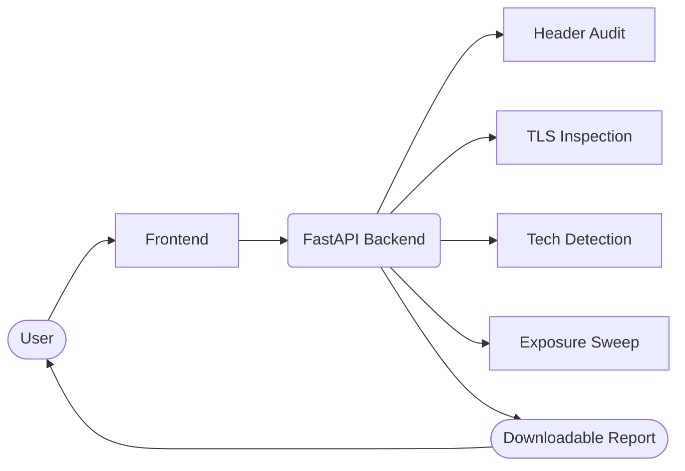

# VulnVision — Passive Reconnaissance & Exposure Radar 🚀

[](https://sr-857.github.io/vulnvision)
[](https://vulnvision.onrender.com/docs)
[](./LICENSE)

VulnVision delivers a judge-ready passive reconnaissance experience: point the dashboard at any public target and watch it fingerprint technologies, grade security headers, inspect TLS metadata, surface exposed panels, and package the findings into a downloadable HTML report.

> **Ethical use only.** VulnVision performs non-intrusive, read-only checks. Obtain permission before scanning a target.

---

## ✨ What’s Included

- **Live dashboard** served via GitHub Pages — zero setup for judges
- **FastAPI backend** on Render — shared API powering the scan and report endpoints
- **Technology detection engine** combining DOM signatures, response headers, and favicon hashing
- **Exposure sweeps** across 30+ high-signal paths (git leaks, config dumps, admin panels, monitoring consoles)
- **TLS intelligence** with expiry warnings, SAN display, and risk snapshots
- **Rate limiting + caching** to keep the API responsive during demos
- **HTML report** that mirrors the dashboard layout for handover

## 🌐 Live Experience

- **Dashboard:** [sr-857.github.io/vulnvision](https://sr-857.github.io/vulnvision/) — responsive landing + scan console with live API wiring.
- **API Gateway:** [vulnvision.onrender.com](https://vulnvision.onrender.com/) — FastAPI service exposing `/scan` and `/report`, protected by caching and rate limiting.
- **Sample Report:** [docs/examples/demo_report.html](docs/examples/demo_report.html) — downloadable HTML dossier mirroring the dashboard presentation.

Launch the dashboard, trigger a scan, and hand off the report within 60 seconds — no local setup required.

## 🧩 Architecture Overview




---

## ⚡ Quick Start (Local)

```bash
# 1. Install backend dependencies
python3 -m venv .venv && source .venv/bin/activate
pip install -r backend/requirements.txt

# 2. Run the API
uvicorn backend.main:app --reload --port 8000

# 3. Open the dashboard
open docs/index.html  # or serve docs/ via any static server
```

Set the **API Base** input (top-right of the dashboard) to `http://localhost:8000` and start scanning.

---

## 🌐 Production Deployment

| Component | Hosting | Notes |
| --- | --- | --- |
| Frontend | GitHub Pages (`/docs`) | Already live at [sr-857.github.io/vulnvision](https://sr-857.github.io/vulnvision) |
| Backend | Render Web Service | Deploy `backend/` with start command `uvicorn main:app --host 0.0.0.0 --port $PORT` |
| API Base Override | `window.VULNVISION_API_BASE` | Configured in `docs/index.html` to hit `https://vulnvision.onrender.com` |

### Render deployment checklist

1. Connect the repo and select the `backend` directory.
2. Build command: `pip install -r requirements.txt`
3. Start command: `uvicorn main:app --host 0.0.0.0 --port $PORT`
4. Region: any (Free plan works).
5. Copy the resulting URL (e.g., `https://vulnvision.onrender.com`) and update the dashboard override if it changes.

---

## 🛰️ Feature Deep Dive

| Category | Details |
| --- | --- |
| **Risk Storytelling** | Aggregated risk grade with deduplicated bullet reasoning. |
| **Security Headers** | Normalises popular headers (CSP, HSTS, XFO, Referrer, Permissions) with colour-coded status. |
| **TLS Summary** | Presents subject, issuer, validity window, SANs, findings, and expiry countdown. |
| **Technology Fingerprinting** | DOM + header signatures, meta generator parsing, favicon hashing (mmh3) for WordPress, React, Angular, Vercel, Wix, GitHub Pages, etc. |
| **Exposure Recon** | 30+ high-signal paths (git leaks, env files, backups, admin consoles, metrics endpoints) with risk scoring. |
| **Caching + Rate Limits** | 120-second cache per target + 30 req/minute global limiter keeps the shared demo reliable. |
| **Reporting** | `/report` reuses the same payload and renders a styled HTML export. |

---

## 📦 API Reference (UI Contract)

`POST /scan`

```json
{
  "target": "example.com"
}
```

Response (abridged):

```json
{
  "target": "example.com",
  "fetched_url": "https://example.com/",
  "status_code": 200,
  "risk": {
    "level": "Low",
    "reasons": ["No significant issues detected"]
  },
  "technology": [
    {"name": "Cloudflare", "confidence": "Medium", "evidence": "server: cloudflare"}
  ],
  "headers": [
    {"header": "content-security-policy", "status": "missing", "note": "Define CSP"}
  ],
  "tls": {
    "subject": "CN=example.com",
    "issuer": "DigiCert Inc",
    "valid_from": "2025-01-01T00:00:00Z",
    "valid_to": "2025-03-31T23:59:59Z",
    "days_remaining": 45,
    "findings": ["Certificate expires within 60 days"]
  },
  "exposures": [],
  "raw_headers": {
    "server": "cloudflare"
  },
  "response_headers": {
    "server": "cloudflare"
  },
  "scanned_at": "2025-11-16T04:12:00+00:00"
}
```

`POST /report` accepts the same payload and returns the HTML report.

---

## 🧪 Quality & CI

- **Smoke tests:** Minimal pytest ensures the FastAPI app imports successfully.
- **Formatting:** Prettified dashboard, shared CSS modifiers, HTML report aligned with UI wording.
- **Security:** Subresource Integrity (SRI) on CDN assets, permissive CORS for demo, rate throttling.
- **Roadmap:** Add unit coverage for scanners, integrate CodeQL, publish container image.

See `.github/workflows/ci.yml` for the current pipeline.

---

## 🤝 Contributing & Hackathon Checklist

- **Showcase the feature depth:** Run live scans against `demo.owasp-juice.shop` to produce technology fingerprints, TLS insights, and exposure findings that exercise every panel.
- **Refresh visual assets:** Capture updated dashboard and report screenshots, storing them in `docs/assets/screenshots/` for judge-ready collateral.
- **Publish an offline sample:** Export a current HTML report to `docs/examples/demo_report.html` so the experience is reviewable without network access.
- **Cut a release when stabilized:** Tag the frozen demo (`git tag -a v1.0 -m "Hackathon release" && git push origin v1.0`) to capture the final build.
- **Stay within passive boundaries:** All scans should remain read-only and respect the baked-in rate limits; when submitting PRs, preserve that stance.

---

## 📄 License

Released under the [MIT License](./LICENSE).
